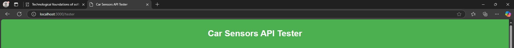
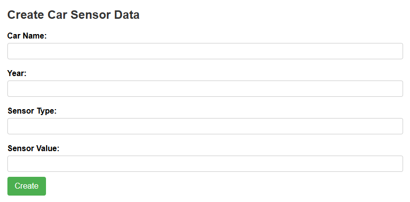
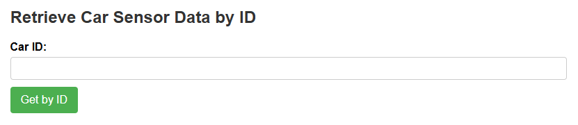
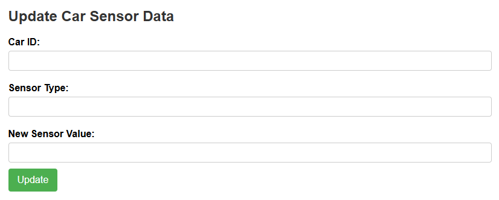
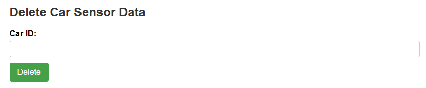
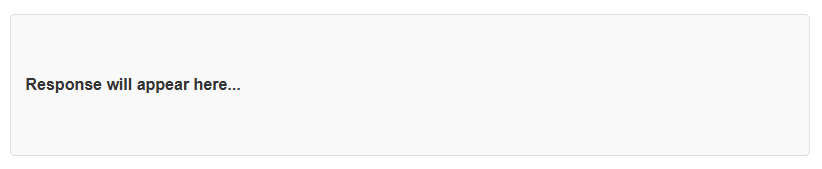
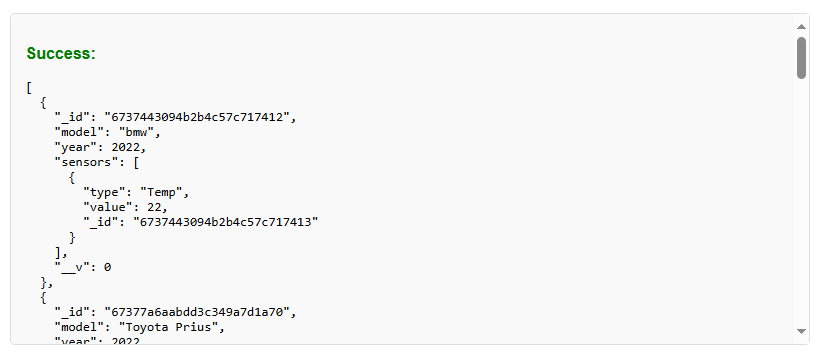
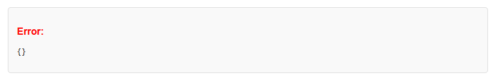

# Car Sensors API Tester

Welcome to the **Car Sensors API Tester**! This project provides a simple and intuitive interface to test API endpoints for managing car sensor data. This tutorial will guide you on how to use the tool effectively.

---

## 🚀 Getting Started

### Prerequisites

1. Ensure you have a running backend server for the API at `http://localhost:3000/tester`.
2. Open the `Car Sensors API Tester` HTML file in any modern web browser.

---

## 🎯 Features Overview

This API Tester provides functionality to:

1. **Create Car Sensor Data**
2. **Retrieve All Car Sensor Data**
3. **Retrieve Car Sensor Data by ID**
4. **Update Car Sensor Data**
5. **Delete Car Sensor Data**

Each feature is described below with instructions.

---

## 🔧 Usage Guide

### 1. Create Car Sensor Data

- **Steps:**
  1. Enter the car name in the "Car Name" field.
  2. Enter the year in the "Year" field.
  3. Provide the sensor type (e.g., "temperature").
  4. Input the sensor value (e.g., "75.5").
  5. Click the **Create** button.
- **API Endpoint Used:** `POST /api/cars`
- **Result:** The new car sensor data will be created and displayed in the response section.

---

### 2. Retrieve All Car Sensor Data

- **Steps:**
  1. Click the **Get All** button.
- **API Endpoint Used:** `GET /api/cars`
- **Result:** All existing car sensor data will be retrieved and displayed.

---

### 3. Retrieve Car Sensor Data by ID

- **Steps:**
  1. Enter the car ID in the "Car ID" field.
  2. Click the **Get by ID** button.
- **API Endpoint Used:** `GET /api/cars/{id}`
- **Result:** Sensor data for the specified car ID will be retrieved and displayed.

---

### 4. Update Car Sensor Data

- **Steps:**
  1. Enter the car ID in the "Car ID" field.
  2. Provide the new sensor type in the "Sensor Type" field.
  3. Enter the new sensor value in the "New Sensor Value" field.
  4. Click the **Update** button.
- **API Endpoint Used:** `PUT /api/cars/{id}`
- **Result:** The car sensor data for the specified ID will be updated and displayed.

---

### 5. Delete Car Sensor Data

- **Steps:**
  1. Enter the car ID in the "Car ID" field.
  2. Click the **Delete** button.
- **API Endpoint Used:** `DELETE /api/cars/{id}`
- **Result:** The car sensor data for the specified ID will be deleted, and the response will confirm the deletion.

---

## 📄 Response Display

- The response from the API will be shown in the **Response** section at the bottom of the page.
- Success messages are displayed in **green**.

   

- Error messages are displayed in **red**.

   

   

---

## 📧 Support

If you encounter any issues or have questions, please contact us at [hind.a.makarem@gmail.com].

---

Enjoy using the Car Sensors API Tester!
